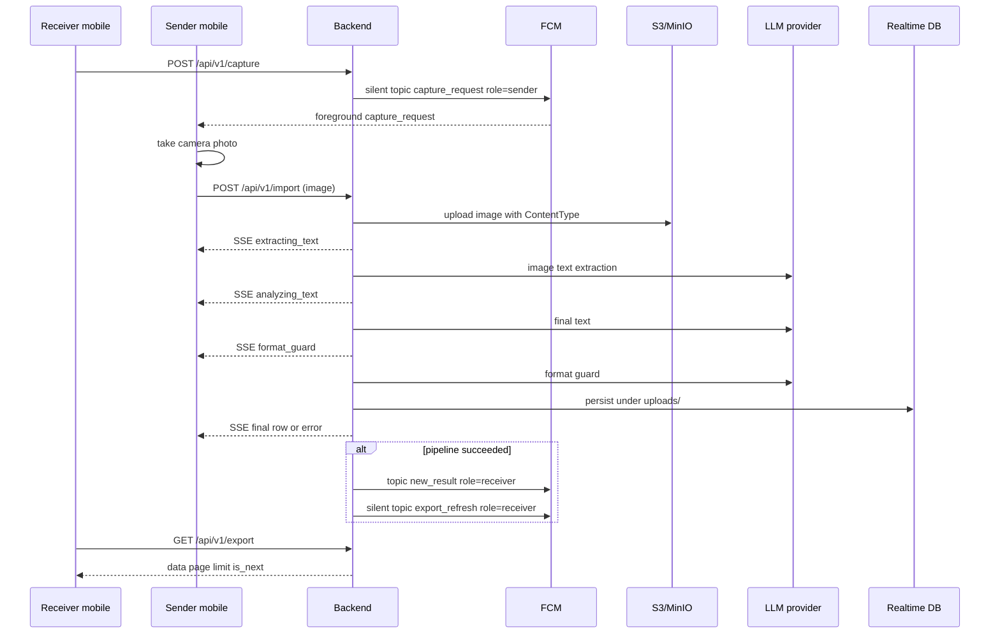

# End-to-end workflow

1. Receiver mobile calls `POST /api/v1/capture`.
2. Backend sends a silent FCM topic data message to sender devices: `kind: capture_request`, `notificationType: silent`, `role: sender`.
3. Sender camera listens for foreground `capture_request` messages, takes a photo, then calls `POST /api/v1/import` with that image.
4. Backend responds **200** with **`text/event-stream`** and streams JSON `data:` lines until processing finishes: progress `{"status":"extracting_text"}`, `{"status":"analyzing_text"}`, and `{"status":"format_guard"}`, then either the full success row (same fields as under `uploads/{id}`) or `{"error":{…}}`.
5. Backend runs the import pipeline in order: **S3/MinIO** (store image with content type metadata) → **extract-stage OpenAI-compatible LLM config** (image text extraction) → **final-stage OpenAI-compatible LLM config** (final text) → **format guard LLM pass** → **Realtime Database** (`uploads/{id}`, one write when the row is ready or on failure). If the pipeline succeeds, it then sends receiver FCM topic signals: visible `kind: new_result` and silent `kind: export_refresh` with `url: /api/v1/export?page=1&limit=20`.
6. Receiver mobile reads canonical list data from `GET /api/v1/export` for newest-first rows (see `backend/openapi.yaml` for `data`, `page`, `limit`, `is_next`). In the current Flutter receiver grid, export refresh is available by pull-to-refresh / reload; the backend FCM payload carries the refresh hint.

## Routes

`GET /api/v1/health`, `POST /api/v1/capture`, `POST /api/v1/import`, `GET /api/v1/export`, `GET /api/v1/prompts`, `PUT /api/v1/prompts`, `GET /openapi.yaml`, `GET /docs` (Scalar). Production adds the reverse-proxy prefix, for example `https://lowjungxuan.dpdns.org/backend/api/v1/health`.

## Sequence

## Persisted shape (Realtime Database)

Under `uploads/{id}` the server stores JSON with at least `createdAt` and `updatedAt`; on success it adds `extractedText`, `finalText`, `imageUrl`, `bucket`, and `objectKey`; on failure it adds `errorMessage`. Exact keys are defined by the TypeScript type `GrimUpload` in `backend/src/api/v1/model/import.model.ts`.

## Notes

- `POST /api/v1/import` keeps the HTTP connection open until **S3/MinIO**, the configured LLM model steps, the format guard, and the **Realtime Database** write complete (then receiver **FCM** on success). The LLM stages may use different providers or models. Progress is indicated by SSE `data:` lines, not by returning before work finishes.
- Nothing is written under **`uploads/{id}`** until image storage and both text steps have run (or a single error record is written if the pipeline fails).
- `GET /api/v1/export` is the source of truth for list data; FCM is only a hint after success.
- Sender capture is implemented for the sender camera foreground flow. Background FCM delivery can wake Dart handlers, but taking a camera photo requires the active sender camera page.

---

**Updated:** 2026-04-25
**Applies to:** grim backend + Flutter capture/import flow (`backend/src/`, `mobile/packages/grim_sender_camera`, `mobile/packages/grim_receiver_grid`)
**Doc version:** 5
