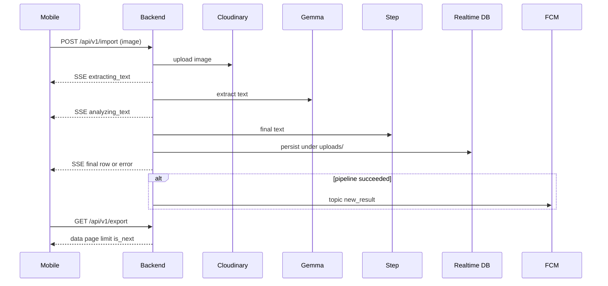

# End-to-end workflow

1. Mobile calls `POST /api/v1/import` with an image.
2. Backend responds **200** with **`text/event-stream`** and streams JSON `data:` lines until processing finishes: progress `{"status":"extracting_text"}` and `{"status":"analyzing_text"}`, then either the full success row (same fields as under `uploads/{id}`) or `{"error":{…}}`.
3. Backend runs the pipeline in order: **Cloudinary** (store image) → **Gemma** (extract text) → **Step** (analyze / final text) → **Realtime Database** (`uploads/{id}`, one write when the row is ready or on failure). If the pipeline succeeds, it then sends an FCM **topic** data message (`kind: new_result`) so subscribed clients can refresh.
4. Mobile calls `GET /api/v1/export` for newest-first rows (see `backend/openapi.yaml` for `data`, `page`, `limit`, `is_next`).

## Routes

`GET /health`, `POST /api/v1/import`, `GET /api/v1/export`, `GET /openapi.yaml`, `GET /docs` (Scalar).

## Sequence

## Persisted shape (Realtime Database)

Under `uploads/{id}` the server stores JSON with at least `createdAt` and `updatedAt`; on success it adds `extractedText`, `finalText`, `imageUrl`, `cloudinaryPublicId`; on failure it adds `errorMessage`. Exact keys are defined by the TypeScript type `GrimUpload` in `backend/src/api/v1/model/import.model.ts`.

## Notes

- `POST /api/v1/import` keeps the HTTP connection open until **Cloudinary**, both model steps, and the **Realtime Database** write complete (then **FCM** on success). Progress is indicated by SSE `data:` lines, not by returning before work finishes.
- Nothing is written under **`uploads/{id}`** until image storage and both text steps have run (or a single error record is written if the pipeline fails).
- `GET /api/v1/export` is the source of truth for list data; FCM is only a hint after success.
